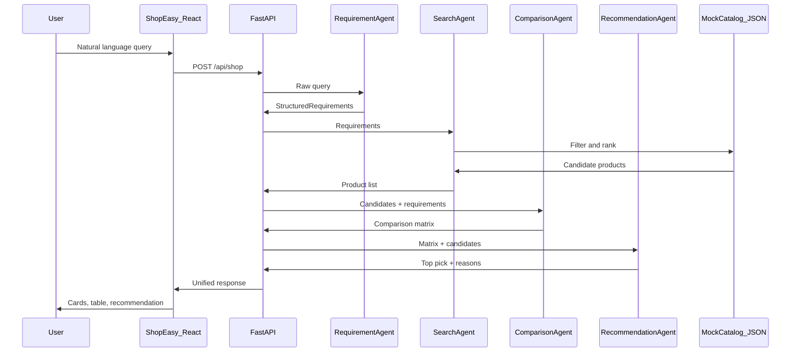

# Multi-Agent AI E-Commerce Shopping Agent (ShopEasy)

## Problem statement

Online shopping often forces users to search many listings across sites, open multiple product pages, and manually compare price, ratings, and specifications. That process is slow and easy to get wrong.

ShopEasy automates this with a **multi-agent pipeline**: the user describes needs in natural language (for example, *"Find wireless headphones under ₹3500 with good sound quality"*), and four agents cooperate to parse requirements, search a catalog, build a comparison table, and recommend the best match.

## Architecture



| Agent | Role |
|-------|------|
| **RequirementAgent** | LLM (with heuristic fallback) → category, budget, keywords, priorities |
| **SearchAgent** | Filters mock `products.json`, ranks matches (max 8) |
| **ComparisonAgent** | Builds criteria × product comparison table |
| **RecommendationAgent** | LLM (with heuristic fallback) → one catalog `product_id` + reasons |

Orchestration uses **LangGraph** (`backend/app/orchestrator.py`).

## Project layout

```
Multi_Agent/
  backend/          # FastAPI + LangGraph + agents
  frontend/         # React (Vite) ShopEasy UI
  README.md
```

## Prerequisites

- Python 3.11+ recommended
- Node.js 18+
- Optional: `OPENAI_API_KEY` for LLM-powered requirement parsing and recommendations (works without it via heuristics)

## Backend setup

```powershell
cd backend
python -m venv .venv
.\.venv\Scripts\Activate.ps1
pip install -r requirements.txt
copy .env.example .env
# Edit .env and set OPENAI_API_KEY if you have one
uvicorn app.main:app --reload --host 127.0.0.1 --port 8000
```

API:

- `GET /health`
- `POST /api/shop` — body: `{ "query": "..." }`

## Frontend setup

In a second terminal:

```powershell
cd frontend
npm install
npm run dev
```

Open [http://localhost:5173](http://localhost:5173). Vite proxies `/api` to the backend on port 8000.

Optional: set `VITE_API_URL=http://127.0.0.1:8000` in `frontend/.env` if you are not using the dev proxy.

## Demo query

```
Find wireless headphones under ₹3500 with good sound quality
```

You should see product cards, an **AI Agent Comparison** table, **Recommended for you**, and expandable **Agent steps**.

## Notes

- Product data is **mock JSON** only (`backend/data/products.json`) — no live marketplace scraping.
- Recommendations are validated so `product_id` must exist among search candidates (no hallucinated products).
